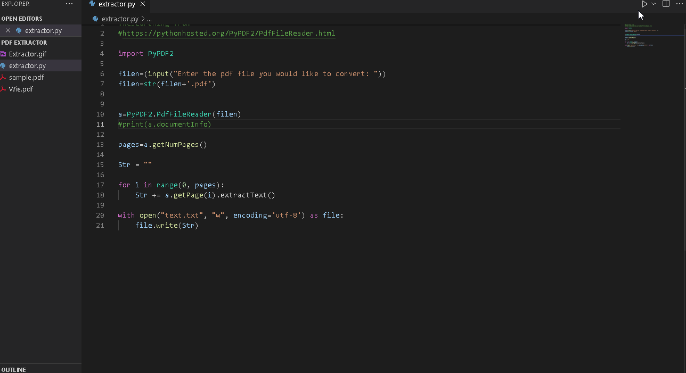

# Python-Pdf-Viewer
Converting Pdf into txt files using pyPdf2 library Python GUI

**PDF Extractor** is a python app that allows to extract text from PDF files, just like the "Adobe" App that converts PDF to Word. 

Submitted by: **Devansh Goel**

Time spent: **1** hours spent in total

## User Stories

The following **required** functionality is completed:

* [x] User can **Convert PDF files to text files**
* [x] User can **Also save the Coverted text as PDF after doing changes**

## Video Walkthrough

Here's a walkthrough of implemented user stories:

GIF created with [LiceCap](http://www.cockos.com/licecap/).

## Notes

It is better to use the Photomap Library to import images in the GUI program.

## License

    Copyright [2021] [Devansh]

    Licensed under the Apache License, Version 2.0 (the "License");
    you may not use this file except in compliance with the License.
    You may obtain a copy of the License at

        http://www.apache.org/licenses/LICENSE-2.0

    Unless required by applicable law or agreed to in writing, software
    distributed under the License is distributed on an "AS IS" BASIS,
    WITHOUT WARRANTIES OR CONDITIONS OF ANY KIND, either express or implied.
    See the License for the specific language governing permissions and
    limitations under the License.
